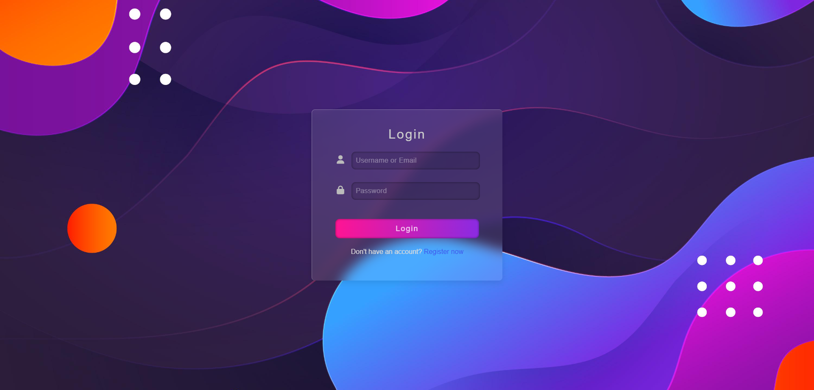
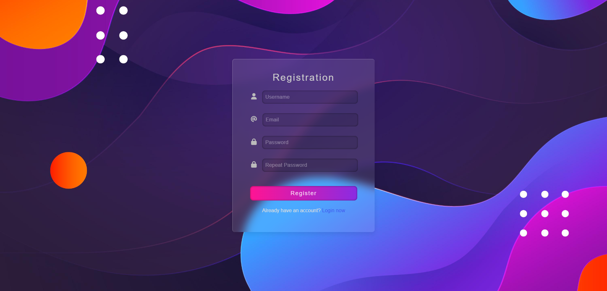
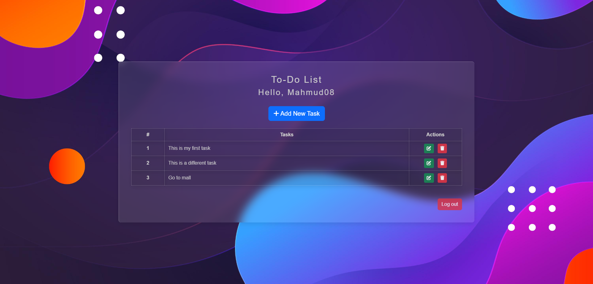

# 📝 To-Do List Website

A simple and elegant **To-Do List web app** with **User Authentication** (Registration & Login) and **Task Management Dashboard** (add / edit / delete). Modern, colorful UI with gradients and soft glassmorphism panels.

   
  <em>Login</em>

   
  <em>Registration</em>

   
  <em>Task Management Dashboard</em>

---

## ✨ Features

- 🔐 Register & Login (session-based auth)
- 👋 Personalized greeting on dashboard
- ➕ Add tasks
- ✏️ Edit tasks
- 🗑️ Delete tasks
- 🎨 Clean, responsive UI

---

## 🧰 Tech Stack

- **Frontend:** HTML, CSS, JavaScript  
- **Backend:** PHP  
- **Database:** MySQL

---
